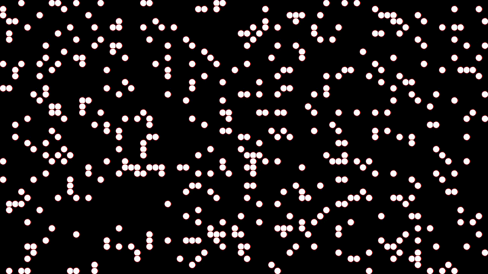

# Game of Life

Conway's Game of Life implemented in C++ and SFML. You can find the details for Conway's Game of Life [here](https://en.wikipedia.org/wiki/Conway%27s_Game_of_Life).

## Built With

- [SFML](https://www.sfml-dev.org/)

## Rules

1. Any live cell with fewer than two live neighbors dies, as if caused by underpopulation.
2. Any live cell with two or three live neighbors lives on to the next generation.
3. Any live cell with more than three live neighbors dies, as if by overpopulation.
4. Any dead cell with exactly three live neighbors becomes a live cell, as if by reproduction.

### Controls

`space`       -> Play / Pause

`left click`  -> Make cell alive

`right click` -> Make cell dead

## Demo

